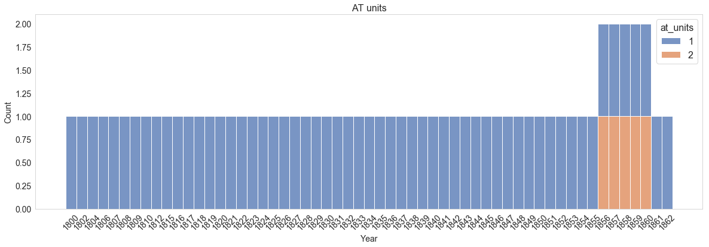

.. _issues-with-data-models:

=======================
Issues with data models
=======================

Missing ``code_tables``
-----------------------

Documenting supplemental data from ICOADS is not an easy task since the metadata information format (stored in the imma ``c99`` section) vary from deck to deck and is often incomplete for several collections. You might be able to find all the information about the ``c99`` string separation, but you might be missing the ``code_tables`` to *decode* what the value of that variable means (e.g. Temperature units are said to be recorded as 1, 2 and 3, but there isn't a clue of what that number means in terms of temperature units 1=C, F or K?).

In the case that we can put together a **schema**, but we are missing some of the ``code_tables`` or the ICOADS information is incomplete, we can use the **mdf_reader** as tool for generating **missing code_tables**.

An example of how to address this particular issue can be found in the script below::

    #!/usr/bin/env python3
    # -*- coding: utf-8 -*-
    """
    Gather missing air temperature from deck 701 c99
    US Maury Collection of historical ships' weather logs
    """
    import os
    import sys
    # Defined your working directory where you have the mdf_reader folder stored!
    sys.path.append('working_dir')
    import mdf_reader
    import pandas as pd
    import numpy as np
    import mdf_reader
    import json
    import pickle
    from collections import defaultdict

    funPath = os.path.dirname(os.path.abspath(__file__))

    # This directory should be the raw level0 files from ICOADS.
    # Need to be modify if such files have change location
    data_jasmin = '/gws/nopw/j04/glamod_marine/data/datasets/ICOADS_R3.0.0T/level0/069-701'
    print(data_jasmin)

    # Year array of the years cover by the deck 701 time series.
    years = np.arange(1784, 1863)
    print(years)

    # Make sure you change this and working_dir to the path of your convenience
    output_path = 'working_dir/069-701/'

    # This variable corresponds to the $SLURM_ARRAY_TASK_ID
    # and indicates what index of the year array should be run
    i = int(sys.argv[1])

    year = years[i]
    print(year)

    # Here we make sure we iterate over months for each year of data
    months = ['01', '02', '03', '04', '05', '06', '07', '08', '09', '10', '11', '12']

    paths_files = []
    for m in months:
        path = os.path.join(data_jasmin, str(year)+'-'+m+'.imma')
        #print(path)
        # Here we check if that data file MM-YYYY
        # exist for deck 069-701 and we store the file paths that exist
        if os.path.exists(path):
            paths_files.append(path)

    print(paths_files)

    # We get the schema from the mdf_reader library for that deck
    schema_lib = os.path.join(os.path.dirname(funPath),'data_models','lib')

    print(schema_lib)

    schema_name = 'imma1_d701'

    model_path = os.path.join(schema_lib, schema_name)
    print(model_path)

    d = defaultdict(list)
    at_units = []

    for path, m in zip(paths_files, months):
        # We apply the schema and read the data
        data = mdf_reader.read(path, data_model_path= model_path)
        # We store the name of the file only... to name out output later
        names = os.path.split(path)[1][0:7]
        # We find out for each imma file the type of values stored in temp_ind variable
        at_unit = data.data[["c99_data"]].c99_data.temp_ind.value_counts(dropna=False).to_frame()
        at_units.append(at_unit)

    d['at_units'] = pd.concat(at_units, axis=1).sum(axis=1)

    fp = os.path.join(output_path, str(year) + 'at_units.pkl')
    #print(fp)

    with open(fp, 'wb') as f:
        pickle.dump(d, f, protocol=-1)

    print('Done!')

The above script runs in JASMIN via SLURM::

    #!/bin/bash
    #SBATCH --partition=short-serial-4hr
    #SBATCH --array=1-78
    #SBATCH --job-name=maury_atunits
    #SBATCH --output=slurm_log_output/maury_atunits_%A_%a.out
    #SBATCH --error=slurm_log_output/maury_atunits_%A_%a.err
    #SBATCH --mem=4000
    #SBATCH --time=00:29:00

    module load jaspy

    source /home/users/brecinos/c3s_work/env0/bin/activate

    echo "starting from year number $SLURM_ARRAY_TASK_ID"

    python /home/users/brecinos/c3s_work/mdf_reader/tests/at_units_overview_c99.py $SLURM_ARRAY_TASK_ID

    echo "Done slurm task ID = $SLURM_ARRAY_TASK_ID"

The output of this run is a series of `pickle files <https://www.datacamp.com/community/tutorials/pickle-python-tutorial>`_ for each year in the data set ``1792.pkl`` and they store the value assigned to the temperature unit and how many times this value repeats in a month and year over the entire time series of the data. You can modify this extension easily if you want.

The script below explains how to read the output files and make a bar plot of the data::

    import os
    import sys
    import pandas as pd
    import numpy as np
    import pickle
    from collections import defaultdict
    import glob

    # Plot details
    import seaborn as sns
    sns.set_style("whitegrid")
    import matplotlib.pyplot as plt
    import matplotlib.dates as mdates
    from matplotlib import rcParams
    rcParams['axes.labelsize'] = 14
    rcParams['xtick.labelsize'] = 14
    rcParams['ytick.labelsize'] = 14
    rcParams['legend.fontsize'] = 16
    rcParams['legend.title_fontsize'] = 16

    # FUNCTIONS TO READ IN THE DATA
    # -----------------------------
    def get_values(dic, key, year):
    """
    Get individual sets of values from the pickle dataframe
    Params:
    ------
    dic: python dictionary containing all variables stats per year
    key: variable name
    year: year to extract
    Returns:
    --------
    indexes: these are the variable types
             (e.g. 1 or 2 for air temperature units)
    series.values: these are the counts of how many that
                   variable gets repeated over the time series
    year: year to sample
    """
    series = dic[key]
    indexes = series.index.values
    year = np.repeat(year, len(indexes))
    return indexes, series.values, year

    def extract_year_arrays(path_to_file, key):
    """
    Reads pickle file and extracts the variable arrays per year
    Params:
    -------
    path_to_file: path to the pickle file
    key: variable to extract
    Returns:
    --------
    df: dataframe from get_df
    """
    with open(path_to_file, 'rb') as handle:
        base = os.path.basename(path_to_file)
        year = os.path.splitext(base)[0]
        dic_pickle = pickle.load(handle)
        df = get_values(dic_pickle, key, year)
        return df

    def make_data_frame(list_of_files, main_directory, key):
    """
    From pickle to a time series data frame of all possible values
    for the specific variable that is missing
    Params:
    -------
    list_of_files: all pkl file names
    main_directory: main path where the files are saved
    key: name of the variable to extract as saved in
         the production script of the pickle files
         e.g. at_units
    """

    # Define empty arrays to store the data
    years=np.array([])
    types_of_var = np.array([]) #possible values of that missing variable
    counts_var = np.array([]) # how many times that value repeats

    for file in list_of_files:
        full_path = os.path.join(main_directory, file)
        #print(extract_year_arrays(full_path, key))
        var_type, count, year_f = extract_year_arrays(full_path, key)
        years = np.concatenate([years, year_f])
        types_of_var = np.concatenate([types_of_var, var_type])
        counts_var = np.concatenate([counts_var, count])

    dataset = pd.DataFrame({'Year': years,
                            key: types_of_var, 'Count': counts_var})
    return dataset

    # ----- Applying the functions defined above ----------

    dirs = 'working_dir/069-701/*.pkl'
    print(dirs)
    file_names = sorted(glob.glob(dirs))

    print(file_names[0:5])

    # List of variables names stored in the pickle files
    dic_keys = ['at_units']

    # All the information stored in one data frame
    df_at_units = make_data_frame(file_names, dirs, dic_keys[0]).dropna()

    print(df_at_units.at_units.unique())

    # --- Plot the data with seaborn ----------------------

    fig = plt.figure(figsize=(20,6))
    ax = fig.add_subplot(111)

    g = sns.histplot(data=df_at_units, x="Year", hue="at_units",
                     multiple="stack", palette='deep', ax=ax, legend=True)
    ax.grid(False)
    plt.setp(g.get_xticklabels(), rotation=45)
    plt.title('AT units', fontsize=16)
    plt.show()

Now we have an idea of what are the values for the air temperature:

    Air temperature units entry for deck 701.

And by looking at the data values for the respective years where there is only 1 or 2, we can infer that the air temperature has values of ``1:Fahrenheit`` and ``2:Celcius``.

Exclusion of data
-----------------

Deck 701 (again!) is a good example of how some times we require more than one data model **mapper** per collection. In this case we need to filter measurements coming from a specific logging form type and assign to ``form type == 2``, sampling hours from ``ICOADS.core.hr`` section and to ``form type == 1``, set the sampling hour of each measurement to 12:00HR local time.

To achieve this we generate first two different cdm mappers:
    - ``icoads_r3000_d701_type1``
    - ``icoads_r3000_d701_type2``

You can explore the difference between these mappers by looking at the files files under: ``../cdm-mapper/lib/mappings``, and you will find the main differences in the fields

- ``report_timestamp`` for form 1 in ``header.json``::

     "report_timestamp": {
        "sections": "core",
        "elements": ["YR","MO","DY", "LON", "LAT"],
        "transform": "datetime_to_cdm_time"
        }

- ``report_timestamp`` for form 2 in ``header.json``::

    "report_timestamp": {
        "sections": "core",
        "elements": ["YR","MO","DY","HR"],
        "transform": "datetime_imma1"
     }

Basically we use two different functions to record each measurement time stamp. To look at these functions check the ``imodel.py`` file for each mapper: ``icoads_r3000_d701_type1.py`` and ``icoads_r3000_d701_type2.py``

Now when we run **level1a**, we will need to set up two different runs and to each run, we will apply a different common data model mapper:

- Configuration of ``level1a.json`` for form 1::

    {
      "job_memo_mb": 16000,
      "job_time_hr": "03",
      "job_time_min": "30",
      "data_model": "imma1",
      "read_sections": [
        "core",
        "c1",
        "c98"
      ],
      "filter_reports_by": {
        "c1.PT": ["0", "1", "2", "3", "4", "5"]
      },
      "cdm_map": "icoads_r3000",
      "source_pattern": "IMMA1_R3.0.0T_????-??",
      "069-701": {
            "job_memo_mb": 4000,
            "job_time_hr": "01",
            "job_time_min": "30",
            "data_model": "imma1_d701",
            "read_sections": [
              "core",
              "c1",
              "c98",
              "c99_data",
              "c99_header"
            ],
            "filter_reports_by": {
              "c1.PT": [
                "0",
                "1",
                "2",
                "3",
                "4",
                "5"
              ],
              "c99_header.form_type": [
                " 1",
                "1 ",
                "1",
                "01"
              ]
            },
            "cdm_map": "icoads_r3000_d701_type1",
            "source_pattern": "IMMA1_R3.0.0T_????-??"
          }
    }

- Configuration of ``level1a.json`` for form 2::

     {
          "job_memo_mb": 16000,
          "job_time_hr": "03",
          "job_time_min": "30",
          "data_model": "imma1",
          "read_sections": [
            "core",
            "c1",
            "c98"
          ],
          "filter_reports_by": {
            "c1.PT": ["0", "1", "2", "3", "4", "5"]
          },
          "cdm_map": "icoads_r3000",
          "source_pattern": "IMMA1_R3.0.0T_????-??",
          "069-701": {
                "job_memo_mb": 4000,
                "job_time_hr": "01",
                "job_time_min": "30",
                "data_model": "imma1_d701",
                "read_sections": [
                  "core",
                  "c1",
                  "c98",
                  "c99_data",
                  "c99_header"
                ],
                "filter_reports_by": {
                  "c1.PT": [
                    "0",
                    "1",
                    "2",
                    "3",
                    "4",
                    "5"
                  ],
                  "c99_header.form_type": [
                    " 2",
                    "2 ",
                    "2",
                    "02"
                  ]
                },
                "cdm_map": "icoads_r3000_d701_type2",
                "source_pattern": "IMMA1_R3.0.0T_????-??"
              }
     }

On each run we will be able to find the excluded files under: ``$data_directory/release_demo/ICOADS_R3.0.0T/level1a/excluded``

Invalid data
-------------

After running **level1a** some measurements might not be mapped to the C3S CDM format. This can be for several reasons, but the main reason is that they did not pass the validation after the **mdf_reader** read the data with the specified schema.

For a value to be map it has to match the element properties specified in the **schema** (e.g. encoding, be between a valid range, be a value contemplated in a code_table, etc). Such files will be stored under: ``$data_directory/release_demo/ICOADS_R3.0.0T/level1a/invalid``.

In the **invalid** directory, you will find invalid data stored per ``sid-dck`` as ``.psv`` files. This directory contains two types of files:

- The data frame with the original invalid data file: ``YYYY-MM-release_demo-000000-data.psv``
- The mask for the entire file, showing invalid data as ``False``: ``YYYY-MM-release_demo-000000-data.psv``

In the program of your choice, you can identify what variable field is not passing the code validation by looking at which column you find the most ``False``'s and look at the original data values that were recorded. An example of such problem is illustrated below for deck 701:

- ICOADS website information for this deck states that the ``form_type`` consist of two strings and the entry can be 01 or 02::

    {
    "01": "daily",
    "02": "reports more than once a day"
    }

- Therefore, in our schema for this deck we defined a ``code_table`` as stated above.

- But when we ran **level1a**, several files were saved in the invalid data folder, because the original data from that field was actually ingested by using several types of key-number-combinations::

    {
    " 1": "daily",
    " 2": "reports more than once a day",
    "1 ": "daily",
    "2 ": "reports more than once a day",
    "01": "daily",
    "02": "reports more than once a day"
    }

If a value on a field is not contemplated in a ``code_table``, the entire row of the data measurement can be classified as invalid and we can lose information of other important variables that we are more interested in mapping e.g., original air temperature units or platform subtypes.

Make sure that when you construct ``code_tables``, you are taking into account all possible entries for that particular variable.

.. note:: Check that we took into account this issue when we define the ``filter_reports_by`` variable, in the ``level1a.json`` file written above (see exclusion of data).