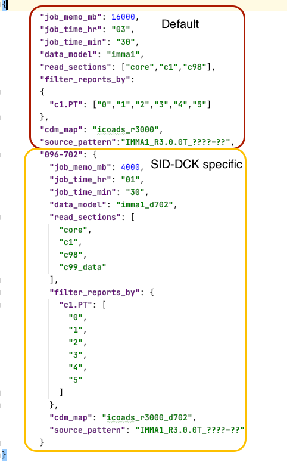

.. _release-workflow:

================
Release workflow
================

Configuration directory set up
------------------------------

The ``$config_directory`` is where we define all the name and configuration details of each release or test. At the moment this directory in JASMIN correspond to the path: ``/gws/smf/j04/c3s311a_lot2/code/marine_code/glamod-marine-config/obs-suite``

.. note:: This might change in the future and is always good to verify if all paths in ``setpaths.sh`` are correct.

To make a release you must follow the following syntax's to create a release tree directory:

+----------------------------+-------------+---------------+
| Data release name examples | Tag         | Data set name |
+----------------------------+-------------+---------------+
| release_demo, release_4.0  | 000000      |ICOADS_R3.0.0T |
+----------------------------+-------------+---------------+

Under the ``$config_directory`` path you need to create the following directory tree::

    $ cd $data_directory
    $ mkdir release_demo-000000
    $ cd release_demo-000000
    $ mkdir ICOADS_R3.0.0T
    $ cd ICOADS_R3.0.0T

.. warning:: Make sure there is ``hyphen: -`` between the release name and the tag.

Inside the ``ICOADS_R3.0.0T`` or data set name directory you will create the following configuration files (``.json``)::

    [ICOADS_R3.0.0T]$ ls
      level1a.json  source_deck_list.txt  source_deck_periods.json

Each file is describe below.

1. ``$ vim source_deck_periods.json``:

This file is a json file with each of the source-deck partitions to be included in the release, and the associated periods (year resolution) to process. The code below shows an example of this file::

        {
        "096-702":
            {
                "year_init": 1867,
                "year_end": 1889
            },
        "143-781":
            {
                "year_init": 1968,
                "year_end": 1993
            }
        }
In this example we will be running the sdi-deck: 096-702 and 143-781. For the last deck "781" we want to run the default configuration applied to all sources and decks from ICOADS but for the deck "702" we want to read in metadata information form the c99 column and we will be applying a specific data model to do that.

2. ``$ vim source_deck_list.txt``:

This is a simple ascii file with the list of source-deck partitions to process. Create the master list with the keys of file source_deck_periods.json. This file can later be subsetted if a given process is to be run in batches. The code below shows a sample of this file::

        096-702
        143-781

3. ``$ vim level1a.json``:

The upper part of the configuration file corresponds to a default run, meaning that you will run this type of configuration for the majority of decks in ICOADS using an "standard" ``.imma`` based schema (``imma1``) and common data model mapper (``icoads_r3000``). The second part of the file (yellow circle) corresponds to a configuration that is "source-deck" specific and for which you will apply a specific data schema and common data model mapper specially modified to document extra metadata information from that specific collection (e.g. ``imma1_d702`` and ``icoads_r3000_d702``) and map that information to the Common Data Model format.

    Level1 configuration file example

You can copy and paste also the lines below::

    {
        "job_memo_mb": 16000,
        "job_time_hr": "03",
        "job_time_min": "30",
        "data_model": "imma1",
        "read_sections": ["core","c1","c98"],
        "filter_reports_by":
        {
          "c1.PT": ["0","1","2","3","4","5"]
        },
        "cdm_map": "icoads_r3000",
        "source_pattern":"IMMA1_R3.0.0T_????-??",
        "096-702":
            {
            "job_memo_mb": 4000,
            "job_time_hr": "01",
            "job_time_min": "30",
            "data_model": "imma1_d702",
            "read_sections": [
                "core",
                "c1",
                "c98",
                "c99_data"
            ],
            "filter_reports_by":
            {
             "c1.PT": ["0","1","2","3","4","5"]
            },
            "cdm_map": "icoads_r3000_d702",
            "source_pattern":"IMMA1_R3.0.0T_????-??"
        }
    }

In the following table we describe what each parameter in the ``level1a.json`` file mean:

======================   ====================================================================
 **json variable**        **Description**
----------------------   --------------------------------------------------------------------
 ``job_memo_mb``          | Memory in MB needed to run the job. This is part of the SLURM set up
                          | defined in the following script: `lotus_scripts.level1a_slurm <https://glamod.github.io/c3s-marine-obs-suit-documentation/_modules/lotus_scripts/level1a_slurm.html#log_diri>`_.
 ``job_time_hr``          | Hours needed to run the job. This is part of the SLURM set up
                          | defined in the following script: `lotus_scripts.level1a_slurm <https://glamod.github.io/c3s-marine-obs-suit-documentation/_modules/lotus_scripts/level1a_slurm.html#log_diri>`_.
 ``job_time_min``         | Minutes needed to run the job. This is part of the SLURM set up
                          | defined in the following script: `lotus_scripts.level1a_slurm <https://glamod.github.io/c3s-marine-obs-suit-documentation/_modules/lotus_scripts/level1a_slurm.html#log_diri>`_.
 ``data_model``           | Data model or schema use to read the input data (e.g. ``imma``).
 ``read_sections``        | Specifies sections to read from the original data that are  
                          | require by the common data model mapper (e.g. ``icoads_r3000``)
                          | **Tip**: for ICOADS always check in the ``.json`` files of
                          | the cdm mapper what sections from the ``.imma`` format are
                          | being map, so don't read all sections when is not necessary
                          | this variable is important when mapping data from section c99
                          | the name of the c99 section is specific to each deck.
 ``filter_reports_by``    | Applies a filter to the input data based on a specific
                          | variable. e.g. the most common among ICOADS is the platform
                          | ``c1.PT`` since in most of the processing we only want to
                          | include data collected by ships ``c1.PT`` from 0-5
                          | **Note**: for deck 701 we added an extra filter based on the
                          | log form type since we have a different cdm mapper for each log
                          | type. Read more in :ref:`issues-with-data-models`.
 ``cdm_map``              | Data model mapper use to map and validate the data to the C3s
                          | CDM format (e.g. ``icoads_r3000``).
 ``source_pattern``       | Common pattern in the string of the data input file name
                          | **tip**: yyyy-mm in the file name will correspond to
                          | the ????-?? symbols.
======================   ====================================================================

Make release source tree
------------------------

After finishing with the ``$config_directory`` files you can go back to the ``$code_directory`` and follow the commands::

    $ cd $code_directory/scripts
    $ python make_release_source_tree.py $data_directory $config_directory release_demo 000000 ICOADS_R3.0.0T

If you now go to the ``$data_directory`` you will then see an output directory with the name of the release.

Run level1a
-----------

For this you have two options running the level in the command line (for just one source-deck and single data input file) or by submitting a job with the SLURM scheduler.

1. In the command line::

    (env0)$ cd $code_directory/scripts
    (env0)$ export level1a_config=$config_directory/release_demo-000000/ICOADS_R3.0.0T/level1a.json
    (env0)$ python level1a.py $data_directory release_demo 000000 ICOADS_R3.0.0T level1a_config 096-702 1867 12

.. note:: **level1a_config** is the path to the ``level1a.json`` configuration file.

2. Submitting a job to SLURM::

    (env0)$ cd $code_directory/lotus_scripts
    (env0)$ export process_list=$config_directory/release_demo-000000/ICOADS_R3.0.0T/source_deck_list.txt
    (env0)$ python level1a_slurm.py release_demo 000000 ICOADS_R3.0.0T $config_directory $process_list

.. note:: **process_list** is the path to the ``source_deck_list.txt`` defined in the ``$config_directory``

If you are running a lot of years and several decks the scheduler might take a while starting the jobs. Patience is key!

Once your jobs have been submitted, you can verify that your run is going well by checking the logs. The logging of each job should be printed in the following directory: ``$data_directory/release_demo/ICOADS_R3.0.0T/level1a/log``

Go to :ref:`issues-with-data-models` to asses the output of your run.